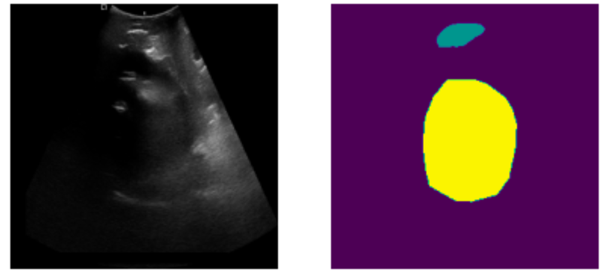
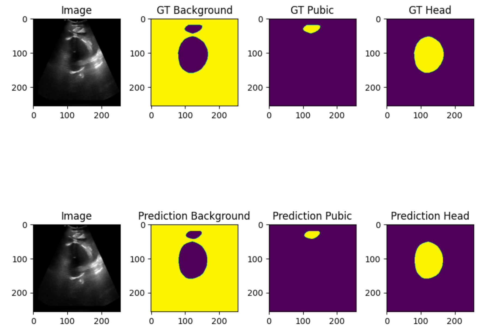
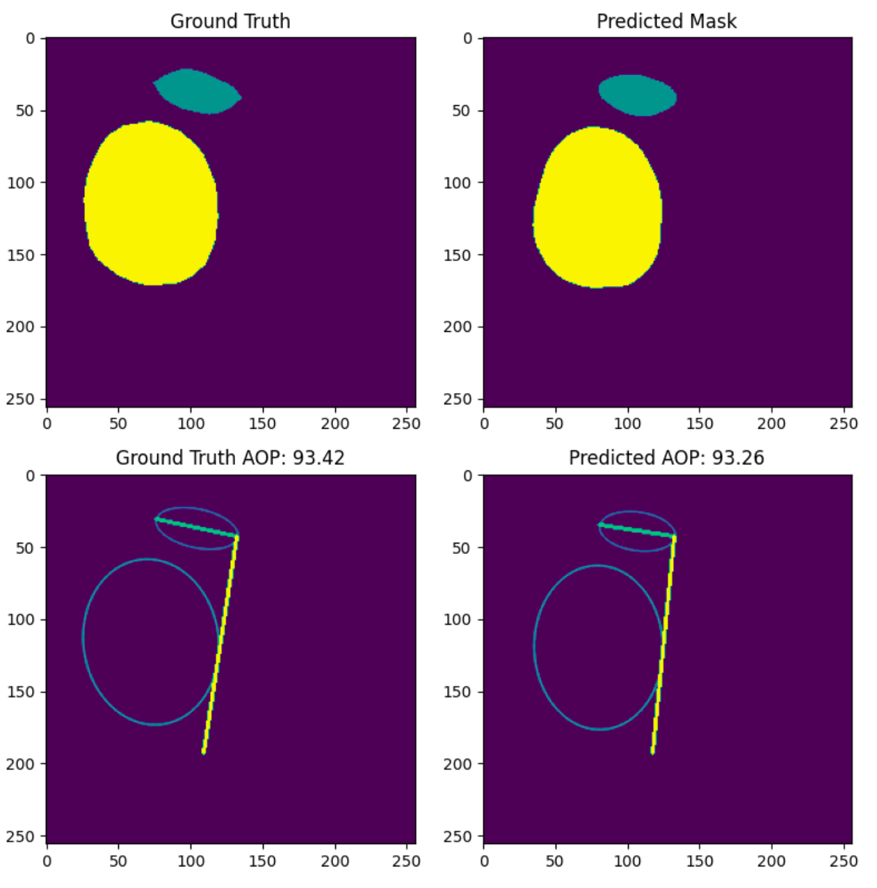

# MICCAI 2023 FH-PS-AOP Challenge 

## Goal of the project 

Addressing the *Pubic Symphysis-Fetal Head Segmentation and Angle of Progression Challenge*, the repository focuses on automating the segmentation of the transperineal ultrasound images. 

The ultimate objective is to enhance the accuracy and objectivity of fetal head descent assessment, crucial for optimizing obstetric practices and minimizing difficult vaginal deliveries. The challenge encourages the development and application of cutting-edge techniques for FH-PS segmentation, serving as a benchmark dataset for comprehensive evaluation and fostering advancements in the field. 

## The dataset 

The JNU-IFM dataset for segmenting pubic symphysis-fetal head is originally introduced in the [article](https://www.sciencedirect.com/science/article/pii/S2352340922001160).

This segmentation competition exclusively utilizes MHA (MetaImage) files for image data, comprising a dataset of **4000 samples**. The original images are in a $3\times256\times256$ format, while the ground truth labels have a shape format of $256\times256$. 

The label pixels are categorized as follows:

* 0: Background

* 1: Pubic Symphysis
  
* 2: Fetal Head

## Architecture

- A **U-Net model** (PyTorch SMP library)  with `mit_b0` encoder (transformer) and `imagenet` pre-trained weights for encoder initialization.
- The file named `segmentation_model.pth` contains the weight parameters of the trained model.
- Execute the `FH_PS_AOP_Challenge.ipynb` notebook to train the designated model.

## Results

- Sensitivity score: 0.986
- Specificity score: 0.993
- Pixel accuracy: 0.991
- Jaccard score: 0.973
- Dice score: 0.986

## Angle of Progression Estimation Algoritm

The implementation details are in the file `aop_estimation.py`. 

## Next updates 
Implement from scratch a ViT model, experiment with existing ones
